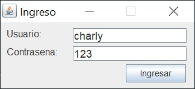
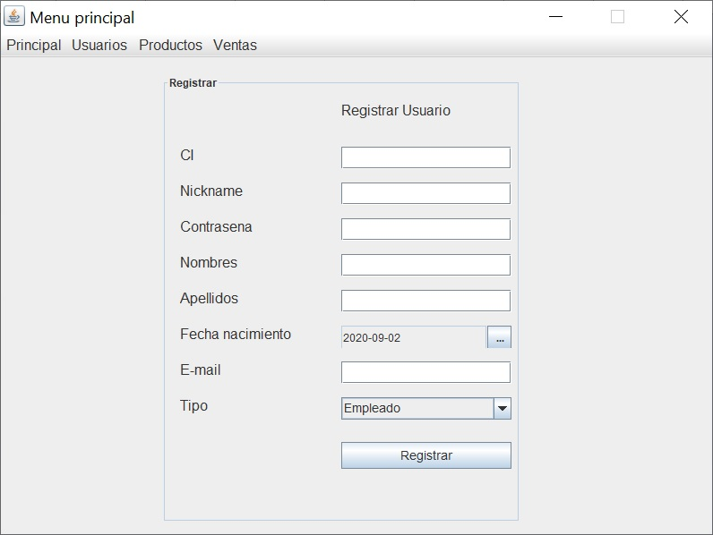
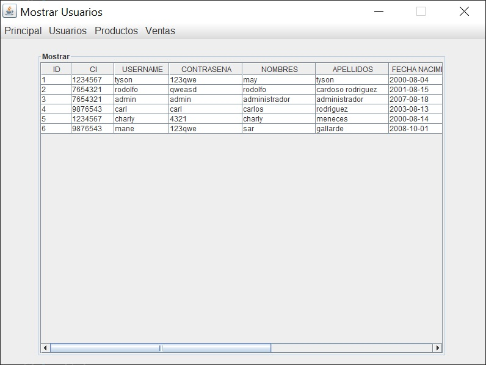
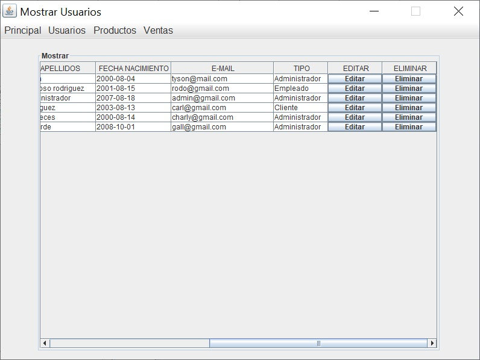
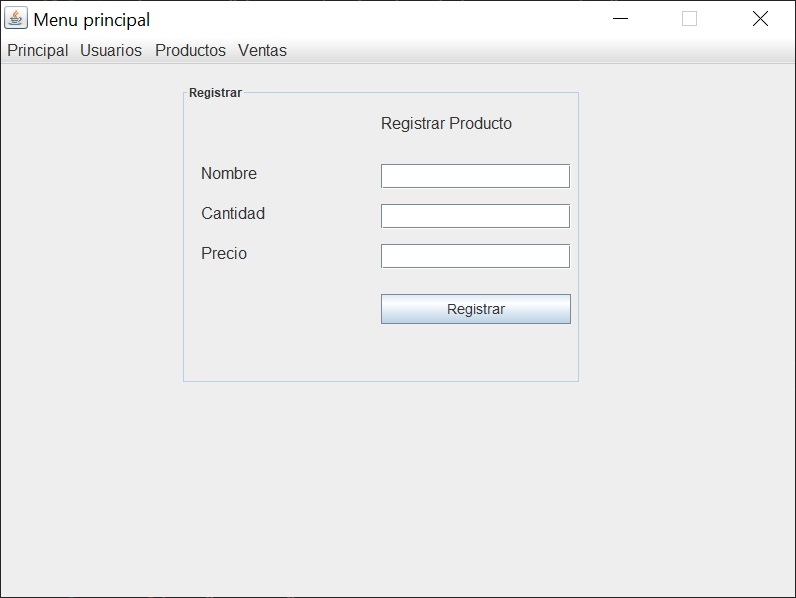
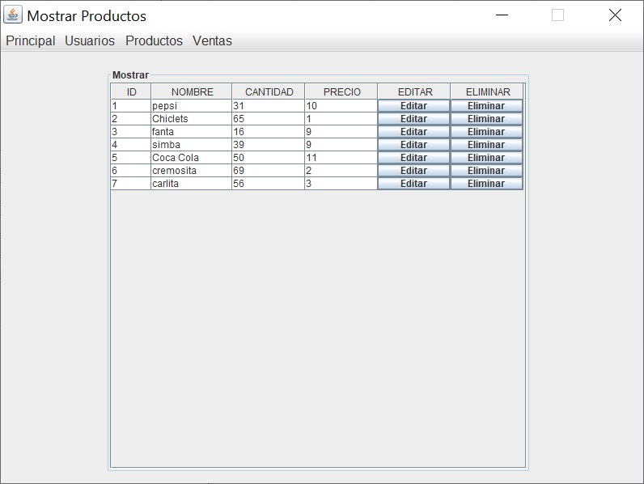
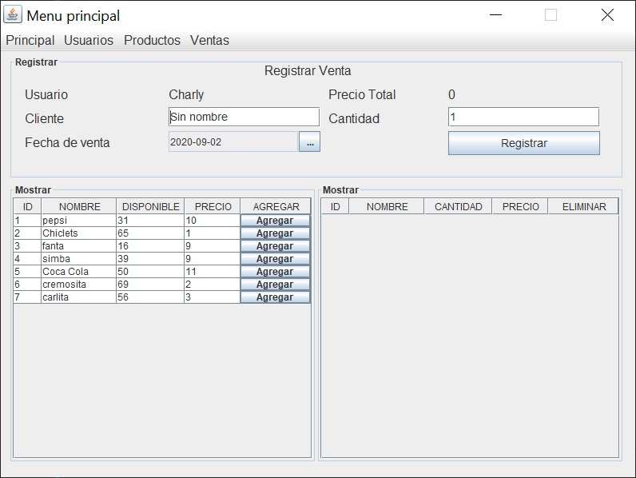
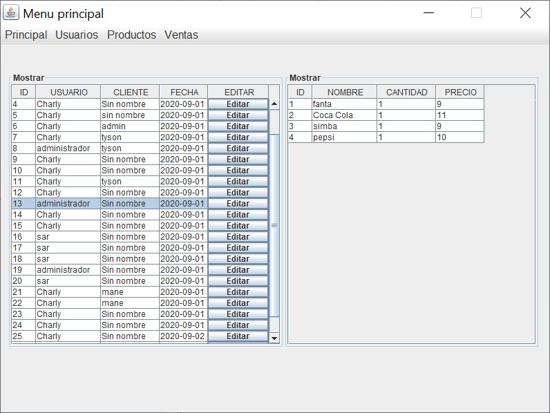

# java-console-edu

Este proyecto es modo consola.

## Pre Requisitos 🚀

1. Instalar Windows 10
2. Instalar Java 1.8.0_201
3. Instalar Gradle 4.4

## Instalacion 🔧

1. Clonar Repositorio: `https://github.com/Joao-123/java-swing-ventas`
2. Generar el JAR: `gradle build`
3. Iniciar programa: `java -jar build/libs/java-swing-ventas.jar`
4. Entrar con: usuario=`charly` contrasena=`123`

## Documentacion

### Diagrama Casos de Uso

  

### Diagrama de clases

  

## UI

### Login

  

### Users registration

  

### Users show

  

  

### Products registration

  

### Products show

  

### Sales registration

  

### Sales show

  

